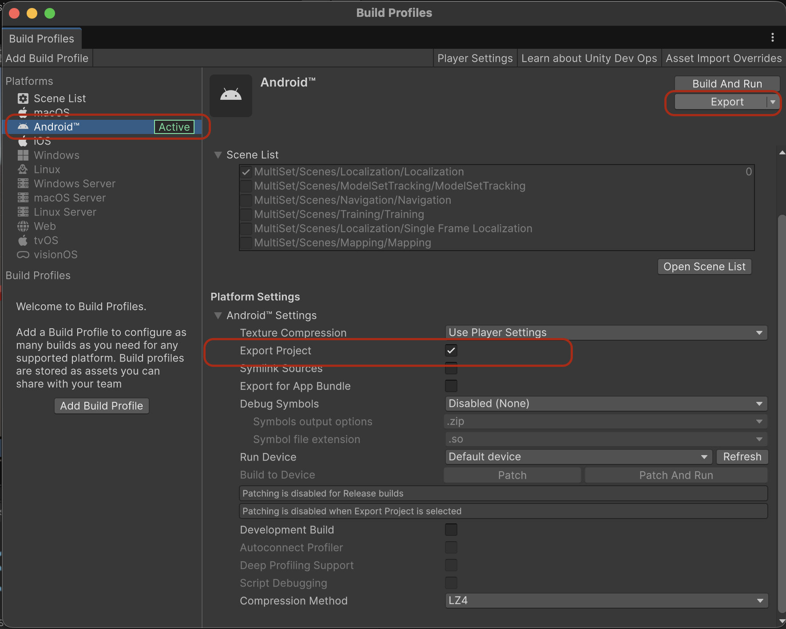

# Unity + Android Integration

## Overview
This repository documents how to embed a Unity experience inside a native Android application. Use it as a reference when exporting a Unity project as an Android library and wiring it into an Android Studio app.

## Repository Structure
- `Unity-Android-Integration.md` – step-by-step integration guide with configuration snippets.
- `Images/` – screenshots referenced throughout the documentation.

## Prerequisites
- Unity 2021 LTS (or newer) with Android Build Support installed.
- Android Studio Flamingo (or newer) with the Android SDK, NDK, and CMake configured.
- Java 11 or higher.

## Quick Start
1. Export your Unity project as an Android Studio project (`File > Build Settings > Android > Export Project`).
2. Open or create the target Android Studio project.
3. Copy the exported `unityLibrary` and `shared` modules into the Android project root.
4. Follow the [detailed integration guide](Unity-Android-Integration.md) to update Gradle files, manifests, and data-sharing code.

## Documentation
The complete integration walkthrough lives in [Unity-Android-Integration.md](Unity-Android-Integration.md) and covers Gradle updates, manifest requirements, and Android <-> Unity communication patterns.

## Troubleshooting Tips
- Align the Android Gradle Plugin version between Unity’s export and your Android project to avoid dependency resolution failures.
- Rebuild the project (`Build > Rebuild Project`) after copying the Unity modules so Android Studio picks up the new Gradle settings.
- Confirm `unityLibrary` uses the `com.unity3d.player` namespace and that required `.aar` files are present under `unityLibrary/libs`.
