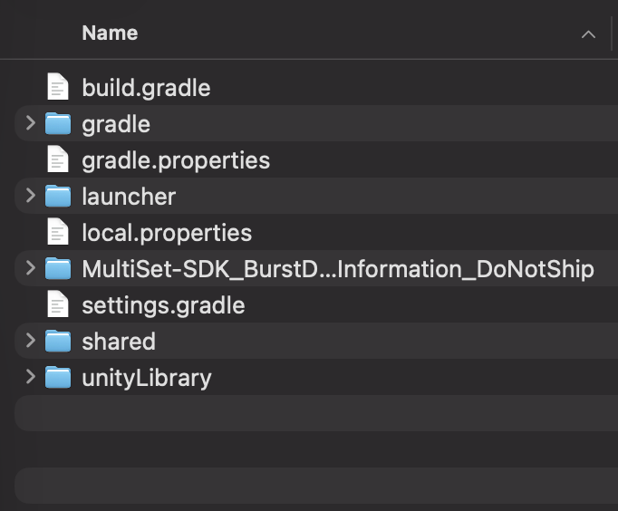
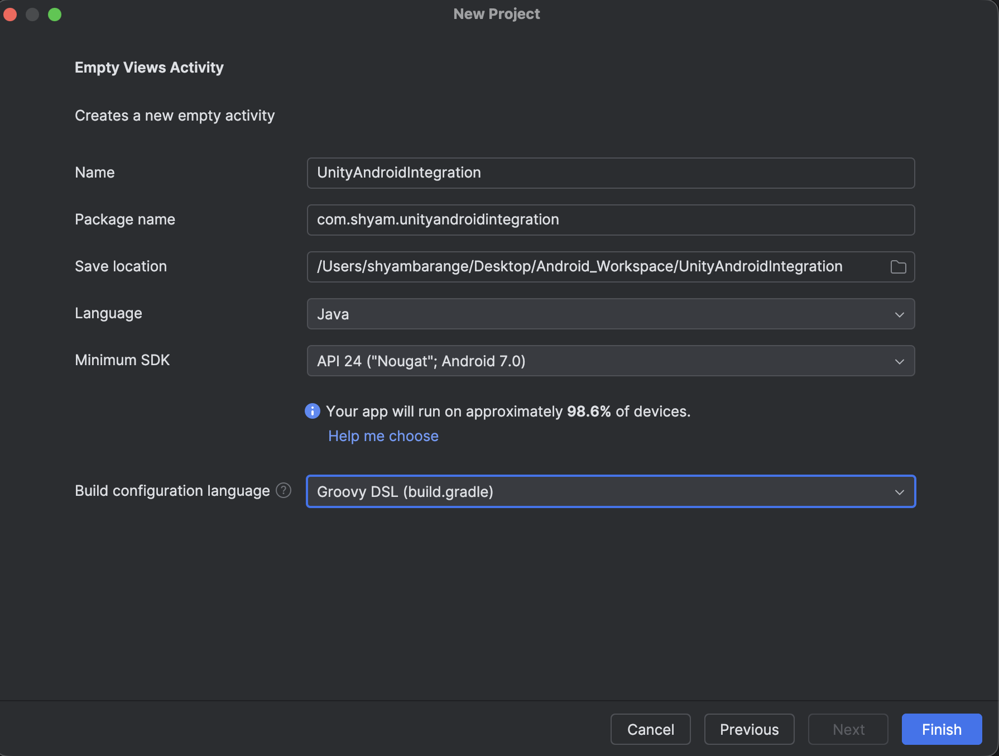
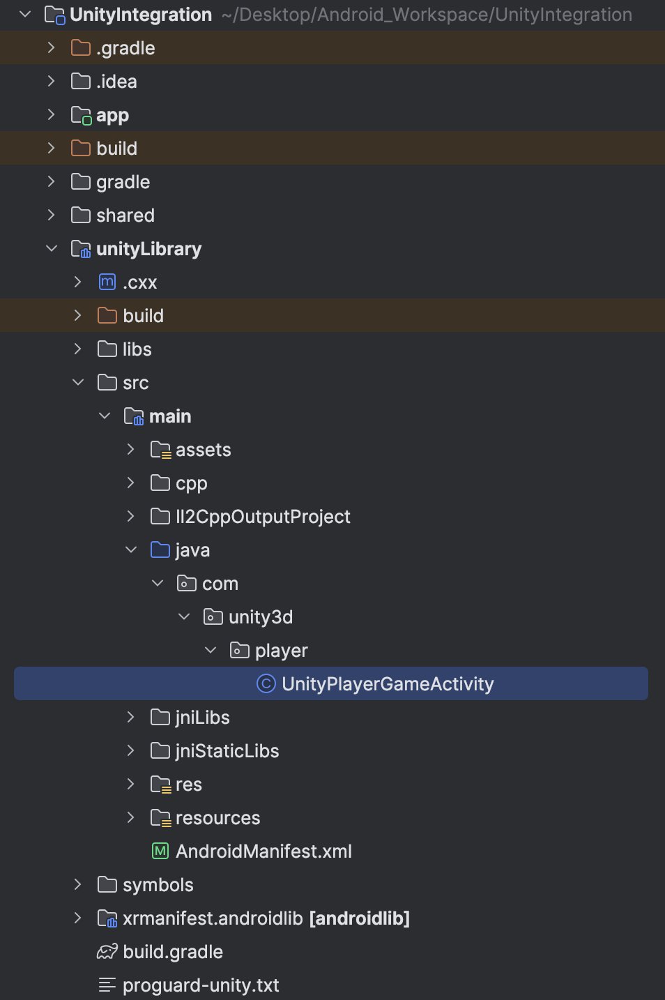
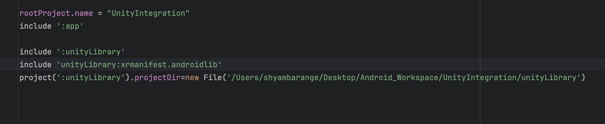
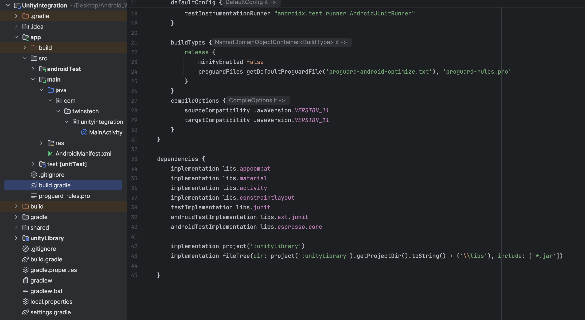
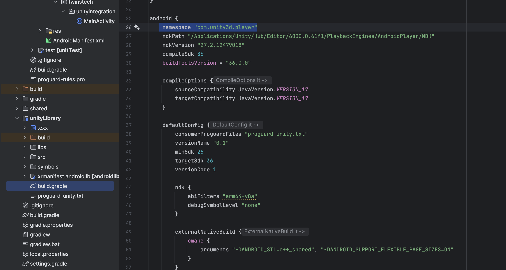
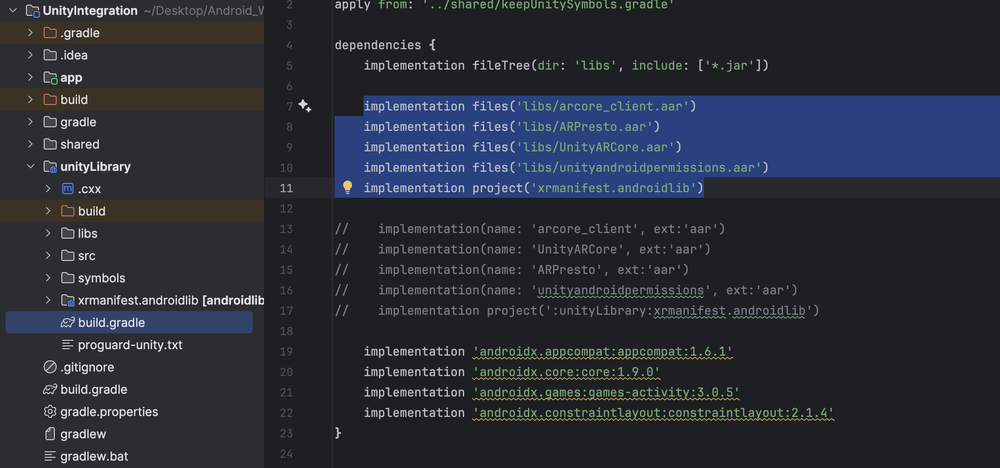

# Unity <-> Android Integration Guide


This guide walks through exporting a Unity project as an Android library and embedding it inside an Android Studio application. Follow each step in order to keep Gradle, Android manifests, and data-sharing code aligned between both environments.

## Table of Contents
- [Prerequisites](#prerequisites)
- [Step-by-step Instructions](#step-by-step-instructions)
  - [Step 1: Export the Unity project](#step-1-export-the-unity-project)
  - [Step 2: Review the exported modules](#step-2-review-the-exported-modules)
  - [Step 3: Prepare (or create) the Android project](#step-3-prepare-or-create-the-android-project)
  - [Step 4: Copy Unity modules into Android Studio](#step-4-copy-unity-modules-into-android-studio)
  - [Step 5: Update `settings.gradle`](#step-5-update-settingsgradle)
  - [Step 6: Reference Unity from the app module](#step-6-reference-unity-from-the-app-module)
  - [Step 7: Configure `gradle.properties`](#step-7-configure-gradleproperties)
  - [Step 8: Set the Unity namespace](#step-8-set-the-unity-namespace)
  - [Step 9: Include Unity `.aar` dependencies](#step-9-include-unity-aar-dependencies)
  - [Step 10: Optional string resources](#step-10-optional-string-resources)
  - [Step 11: Update `AndroidManifest.xml`](#step-11-update-androidmanifestxml)
- [Android and Unity communication](#android-and-unity-communication)
  - [Launch Unity from Android](#launch-unity-from-android)
  - [Pass data to Unity](#pass-data-to-unity)
  - [Receive data from Unity](#receive-data-from-unity)
  - [Expose hooks inside `UnityPlayerGameActivity`](#expose-hooks-inside-unityplayergameactivity)
- [Troubleshooting](#troubleshooting)

## Prerequisites
- Unity 2021 LTS or newer with Android Build Support enabled.
- Android Studio Flamingo or newer with the Android SDK, NDK, and CMake installed.
- Java 11 or higher.
- Gradle wrapper versions aligned between the Unity export and your Android Studio project.

## Step-by-step Instructions

### Step 1: Export the Unity project
Switch the Unity build target to **Android**, open **File › Build Settings**, and choose **Export Project** to generate an Android Studio project structure.

### Step 2: Review the exported modules
Open the exported Unity project; it contains the `launcher`, `unityLibrary`, and `shared` modules.



### Step 3: Prepare (or create) the Android project
Create a new Android Studio project or open your existing application.



### Step 4: Copy Unity modules into Android Studio
Move the exported `unityLibrary` and `shared` modules into the root directory of your Android Studio project.



### Step 5: Update `settings.gradle`
Add the Unity modules to the Gradle settings file so Android Studio can include them in the build.



```groovy
// settings.gradle (Project Settings)
include ':unityLibrary'
project(':unityLibrary').projectDir = new File('...Path..\\AndroidStudioProjects\\AndroidProject\\unityLibrary')
include 'unityLibrary:xrmanifest.androidlib'
```

### Step 6: Reference Unity from the app module
Link the `unityLibrary` module from your app module to make Unity code available to your application.



```groovy
// build.gradle (Module: app)
implementation project(':unityLibrary')
implementation fileTree(
        dir: project(':unityLibrary').getProjectDir().toString() + ('\\libs'),
        include: ['*.jar']
)
```

### Step 7: Configure `gradle.properties`
Ensure Unity streaming assets are copied into the build output.


```properties
# gradle.properties (Project Properties)
unityStreamingAssets=.unity3d, google-services-desktop.json, google-services.json, GoogleService-Info.plist
```

### Step 8: Set the Unity namespace
Confirm the Unity module uses the expected `com.unity3d.player` namespace.



```groovy
// build.gradle (Module: unityLibrary)
namespace 'com.unity3d.player'
```

### Step 9: Include Unity `.aar` dependencies
Load the required Unity `.aar` files from the `libs` directory and reference the XR manifest module.



```groovy
// build.gradle (Module: unityLibrary)
implementation fileTree(dir: 'libs', include: ['*.jar'])

implementation files('libs/arcore_client.aar')
implementation files('libs/ARPresto.aar')
implementation files('libs/UnityARCore.aar')
implementation files('libs/unityandroidpermissions.aar')
implementation project('xrmanifest.androidlib')

// Existing plugin declarations ship the same .aar files and cause duplicate class errors.
// Keep them removed or commented out.
// implementation(name: 'arcore_client', ext:'aar')
// implementation(name: 'UnityARCore', ext:'aar')
// implementation(name: 'ARPresto', ext:'aar')
// implementation(name: 'unityandroidpermissions', ext:'aar')
// implementation project(':unityLibrary:xrmanifest.androidlib')
```

### Step 10: Optional string resources
Expose Unity view descriptions for accessibility if needed.

```xml
<!-- res/values/strings.xml (Module: app) -->
<string name="game_view_content_description">Game view</string>
```

### Step 11: Update `AndroidManifest.xml`
Merge the Unity manifest configuration into your project to request the required permissions and features.

```xml
<!-- AndroidManifest.xml (Module: unityLibrary) -->
<?xml version="1.0" encoding="utf-8"?>
<manifest xmlns:android="http://schemas.android.com/apk/res/android"
    xmlns:tools="http://schemas.android.com/tools">

    <uses-permission android:name="android.permission.INTERNET" />
    <uses-permission android:name="android.permission.ACCESS_NETWORK_STATE" />
    <uses-permission android:name="android.permission.ACCESS_FINE_LOCATION" />
    <uses-permission android:name="android.permission.ACCESS_COARSE_LOCATION" />
    <uses-permission android:name="android.permission.CAMERA" />

    <uses-feature android:glEsVersion="0x00030000" />
    <uses-feature android:name="android.hardware.location.gps" android:required="false" />
    <uses-feature android:name="android.hardware.location" android:required="false" />
    <uses-feature android:name="android.hardware.touchscreen" android:required="false" />
    <uses-feature android:name="android.hardware.touchscreen.multitouch" android:required="false" />
    <uses-feature android:name="android.hardware.touchscreen.multitouch.distinct" android:required="false" />
    <uses-feature android:name="android.hardware.camera.ar" android:required="true" />

    <application
        android:appCategory="game"
        android:enableOnBackInvokedCallback="true"
        android:extractNativeLibs="true">

        <meta-data android:name="unity.splash-mode" android:value="0" />
        <meta-data android:name="unity.splash-enable" android:value="True" />
        <meta-data android:name="unity.launch-fullscreen" android:value="True" />
        <meta-data android:name="unity.render-outside-safearea" android:value="True" />
        <meta-data android:name="notch.config" android:value="portrait|landscape" />
        <meta-data android:name="unity.auto-report-fully-drawn" android:value="true" />
        <meta-data android:name="unity.strip-engine-code" android:value="true" />
        <meta-data android:name="unity.auto-set-game-state" android:value="true" />

        <activity
            android:name="com.unity3d.player.UnityPlayerGameActivity"
            android:process=":unityplayer"
            android:configChanges="mcc|mnc|locale|touchscreen|keyboard|keyboardHidden|navigation|orientation|screenLayout|uiMode|screenSize|smallestScreenSize|fontScale|layoutDirection|density"
            android:enabled="true"
            android:exported="true"
            android:hardwareAccelerated="false"
            android:launchMode="singleTask"
            android:resizeableActivity="true"
            android:screenOrientation="fullUser"
            android:theme="@style/BaseUnityGameActivityTheme">

            <meta-data android:name="unityplayer.UnityActivity" android:value="true" />
            <meta-data android:name="android.app.lib_name" android:value="game" />
            <meta-data android:name="WindowManagerPreference:FreeformWindowSize" android:value="@string/FreeformWindowSize_maximize" />
            <meta-data android:name="WindowManagerPreference:FreeformWindowOrientation" android:value="@string/FreeformWindowOrientation_landscape" />
            <meta-data android:name="notch_support" android:value="true" />
        </activity>

        <meta-data android:name="unityplayer.SkipPermissionsDialog" android:value="true" />
        <meta-data android:name="com.google.ar.core" android:value="required" />
    </application>
</manifest>
```

> **Note:** The `UnityPlayerGameActivity` configuration above is the critical change that enables Unity to run in its own process, respect orientation changes, and communicate back to the hosting Android activity.

## Android and Unity communication

### Launch Unity from Android
Trigger the Unity scene from an Android view or button click.

```java
public void openUnity(View view) {
    Intent unityIntent = new Intent(this, UnityPlayerGameActivity.class);
    startActivity(unityIntent);
}
```

### Pass data to Unity
Send extras via the intent and wait for a result.

```java
private static final int LAUNCH_UNITY = 101;

public void openUnity(View view) {
    Intent unityIntent = new Intent(this, UnityPlayerGameActivity.class);
    unityIntent.putExtra("result", "MultisetSDK");
    startActivityForResult(unityIntent, LAUNCH_UNITY);
}
```

### Receive data from Unity
Handle the Unity activity result inside your Android activity.

```java
@Override
protected void onActivityResult(int requestCode, int resultCode, Intent data) {
    super.onActivityResult(requestCode, resultCode, data);

    if (requestCode == LAUNCH_UNITY && resultCode == RESULT_OK && data != null) {
        String requiredValue = data.getStringExtra("result");
        received_data.setText(requiredValue);
    }
}
```

### Expose hooks inside `UnityPlayerGameActivity`
Add helper methods to Unity's activity so Unity scripts can read data passed from Android and return values when the Unity scene finishes.

```java
public String getDataFromAndroid() {
    return getIntent().getStringExtra("result");
}

public void setDataFromUnity(String cmdLine) {
    Log.wtf("unity", cmdLine);
    Intent returnIntent = new Intent();
    returnIntent.putExtra("result", cmdLine);
    setResult(Activity.RESULT_OK, returnIntent);
    finish();
}
```

## Troubleshooting
- **Duplicate class errors:** Confirm the `.aar` files are only referenced once and remove legacy `implementation(name: ... )` lines.
- **Missing namespaces:** Make sure `namespace 'com.unity3d.player'` is declared in `unityLibrary/build.gradle`.
- **Streaming assets unavailable:** Verify `unityStreamingAssets` is configured in `gradle.properties` and the files exist under `unityLibrary/src/main/assets`.
- **Activity launch issues:** Double-check the `UnityPlayerGameActivity` manifest entry, especially the `android:process=":unityplayer"` and `android:exported="true"` flags.

With these steps complete, your Unity content can coexist with native Android UI, exchange data in both directions, and leverage Unity's AR dependencies within the Android application.
